# Proyecto 2: Base de Datos Multimodal

**Curso:** CS2702 - Base de Datos 2  
**Universidad:** UTEC - Ciencias de la Computación

|Integrantes|Porcentaje|
|-----------|-----------|
|Sebastian Alonso Urbina Claros|100%|
|Anthony Raul Roca Condori |100%|

---

## 1. Introducción

### 1.1 Descripción del Dominio de Datos

Este proyecto implementa una **base de datos multimodal** para la búsqueda y recuperación de información. Para ello, se utilizan dos dominios de datos distintos, cada uno perteneciente a una modalidad diferente:

- **Datos textuales:** Letras de canciones, nombres de pistas y metadatos básicos provenientes del *Spotify Songs Dataset*.  
  Cada registro contiene:
  - `track_id`  
  - `track_name`  
  - `track_artist`  
  - `lyrics`  
  - Atributos musicales (`tempo`, `valence`, `energy`, `danceability`, entre otros)

- **Datos visuales:** Imágenes del dataset **Fashion Product Images**, ampliamente utilizado en tareas de clasificación y recuperación visual.  
  Cada imagen incluye:
  - Fotografía del producto  
  - Categoría del ítem  
  - Descripción corta  
  - Metadatos adicionales dependiendo del tipo de prenda o accesorio

- **Metadatos adicionales:**  
  Incluyen información estructurada como artista, fecha de publicación, categoría del producto, entre otros.

El dataset textual contiene aproximadamente **18,000 canciones** con sus letras completas, lo que permite ejecutar búsquedas por contenido utilizando texto completo.  
El dataset visual contiene miles de imágenes de productos categorizados, permitiendo la extracción de descriptores locales y la construcción de representaciones basadas en Bag of Visual Words.

**Dominio de aplicación:**
- Búsqueda de canciones por fragmentos de letra  
- Recuperación de contenido textual mediante similitud del coseno  
- Búsqueda de productos visualmente similares  
- Integración de resultados de texto e imágenes dentro de una arquitectura multimodal

---

### 1.2 Justificación de la Base de Datos Multimodal

La necesidad de una **base de datos multimodal** surge de las limitaciones de los sistemas tradicionales cuando se trabaja con información heterogénea. En este proyecto, los siguientes factores justifican su implementación:

1. **Búsqueda avanzada por contenido textual:**  
   Los usuarios suelen recordar partes de una letra pero no el nombre exacto de la canción. Un índice invertido en memoria secundaria permite ejecutar búsquedas eficientes sobre texto completo.

2. **Recuperación por similitud visual:**  
   Las imágenes requieren descriptores de alta dimensionalidad y técnicas especializadas como Bag of Visual Words, histogramas y búsqueda KNN.

3. **Consultas complejas y multimodales:**  
   Al unificar texto e imágenes bajo una misma arquitectura, es posible integrar búsquedas como:  
   - “Canciones tristes con tempo bajo”  
   - “Productos visualmente similares pero de distinta categoría”  

4. **Escalabilidad y eficiencia:**  
   El crecimiento continuo de los catálogos de música e imágenes hace indispensable el uso de índices optimizados, tales como:
   - Índices invertidos (texto)  
   - Estructuras vectoriales y KNN (imágenes)

5. **Limitaciones de los motores SQL tradicionales:**  
   Las bases de datos relacionales no están optimizadas para:
   - Texto completo  
   - Similitud vectorial  
   - Procesamiento de imágenes  
   Por ello, se requiere una arquitectura especializada que permita consultas rápidas y relevancia precisa.


---

## 2. Backend – Índice Invertido para Texto

### 2.1 Construcción del Índice Invertido en Memoria Secundaria

Para el módulo textual se implementó un **índice invertido en memoria secundaria**, diseñado para manejar eficientemente colecciones de miles de documentos sin depender de grandes cantidades de RAM. El procedimiento de construcción sigue el algoritmo **SPIMI (Single-Pass In-Memory Indexing)**, cuyo objetivo es generar bloques parciales en disco y luego fusionarlos para obtener un índice completo optimizado.

### 2.2 Explicación Gráfica del Funcionamiento de SPIMI

**Visión General**

El algoritmo **SPIMI (Single-Pass In-Memory Indexing)** permite construir un **índice invertido** procesando los documentos secuencialmente y utilizando la memoria de manera eficiente.  
Su principal ventaja es que:

- No necesita mantener todo el índice en memoria.  
- Genera **bloques parciales** del índice cuando la memoria se llena.  
- Al final, todos los bloques se fusionan para formar el índice invertido final.

---

**Flujo General del SPIMI**

```
Entrada → Preprocesamiento → SPIMI (bloques parciales) → Merge Blocks → Índice Final
```

---

**Explicación Paso a Paso (con diagramas textuales)**

### **Paso 1: Lectura del dataset**
Cada documento se procesa uno a uno:

```
Documento 1 → letras / texto
Documento 2 → letras / texto
Documento 3 → ...
```

### **Paso 2: Preprocesamiento**
Para cada documento:

```
Texto original → normalizar → tokenizar → eliminar stopwords → stemming
```

Ejemplo:

```
"Love you baby" → ["love","babi"]
```

---

### **Paso 3: Construcción del bloque SPIMI**

Cada término se inserta directamente en una tabla hash en memoria:

```
término → [(docId, frecuencia)]
```

Ejemplo parcial:

```
love → [(12,1), (45,3)]
night → [(12,1)]
feel → [(33,2)]
```

---

### **Paso 4: Límite de memoria alcanzado**
Cuando el bloque supera el límite, se escribe en disco:

```
block_0.json
block_1.json
block_2.json
...
```

Cada bloque está ordenado lexicográficamente.

---

### **Paso 5: Merge de Bloques**

Proceso de merge tipo *k-way merge*:

```
block_0     block_1     block_2
   ↓           ↓           ↓
---------------------------------
    Merge a un único índice
```

Resultado:

- **dictionary.txt** → término, offset, df  
- **postings.jsonl** → listas de postings TF-IDF  
- **norms.json** → norma de cada documento  
- **documents.jsonl** → metadatos  

---

**Resultado Final**

El sistema produce un **índice invertido en memoria secundaria**, listo para realizar consultas mediante similitud de coseno:

```
término → lista de (docId, tf-idf)
```

Este índice permite búsquedas eficientes incluso con decenas de miles de documentos.

---

**Diagrama Global SPIMI (ASCII)**

```
 ┌───────────────────────┐
 │       Dataset         │
 └──────────┬────────────┘
            │
            ▼
 ┌───────────────────────┐
 │   Preprocesamiento    │
 │ (tokenizar, limpiar)  │
 └──────────┬────────────┘
            │
            ▼
 ┌─────────────────────────────┐
 │   SPIMI In-Memory Block     │
 │  term → postings            │
 └──────────┬──────────────────┘
            │ (memoria llena)
            ▼
 ┌─────────────────────────────┐
 │      Bloque en disco        │
 │   block_k.json (ordenado)   │
 └──────────┬──────────────────┘
            │
            ▼
 ┌─────────────────────────────┐
 │       Merge Blocks          │
 │   (k-way merge sort)        │
 └──────────┬──────────────────┘
            │
            ▼
 ┌─────────────────────────────┐
 │     Índice Final (TF-IDF)   │
 │  dictionary + postings +    │
 │     norms + documents       │
 └─────────────────────────────┘
```

---

### 2.2 Ejecución Eficiente de Consultas con Similitud de Coseno

Para la recuperación de información se implementó un **motor de búsqueda basado en Similitud de Coseno** sobre representaciones TF–IDF. El sistema está diseñado para cargar en memoria solo los elementos estrictamente necesarios para cada consulta, manteniendo la eficiencia incluso con grandes cantidades de documentos.

**Pipeline de búsqueda**

1. **Preprocesamiento de la consulta**, siguiendo el mismo flujo del preprocesamiento de documentos (normalización, stopwords, stemming).

2. **Cálculo del vector TF–IDF de la consulta**, usando el número total de documentos `N` y el `df` de cada término.

3. **Lectura selectiva de postings:**  
   Solo se cargan los postings de los términos presentes en la query, aprovechando los offsets del `dictionary`.

4. **Acumulación de puntuaciones:**  
   Para cada documento en los postings:
   ```
   score(q,d) = Σ (w_tq * w_td)
   ```

5. **Normalización mediante normas precalculadas:**  
   ```
   cos(q,d) = score(q,d) / (||q|| * ||d||)
   ```

6. **Ranking y Top-K resultados.**

7. **Generación de snippet**, utilizando la función `get_snippet` para mostrar el fragmento donde aparecen los términos de la consulta.

**Características de eficiencia**

- El diccionario se consulta por offset → no se carga completo.  
- Los postings se leen únicamente para los términos requeridos.  
- Las normas de documentos se cargan una sola vez por consulta.  
- Se usa un heap para obtener el Top-K de manera eficiente.  

Este diseño cumple con los requisitos de un **motor de búsqueda en memoria secundaria**, permitiendo consultas rápidas incluso en datasets extensos.

# 2.3 Recuperación de Información Textual en PostgreSQL

PostgreSQL incluye un motor de **Full-Text Search (FTS)** altamente optimizado, que permite indexar, consultar y rankear texto usando estructuras y funciones internas diseñadas para eficiencia y precisión. A continuación se explica cómo PostgreSQL procesa este tipo de consultas.

---

## 2.3.1 Tipos de Índice Utilizados: GIN y GiST

PostgreSQL soporta dos tipos principales de índices para búsquedas textuales sobre columnas `tsvector`:

### **GIN (Generalized Inverted Index)**
- Es el más eficiente para **full-text search**.  
- Implementa un **índice invertido**, muy similar al que construimos con SPIMI.  
- Excelente rendimiento para consultas que involucran muchos términos.  
- Más lento para inserciones, pero extremadamente rápido para consultas.

**Ejemplo:**
```sql
CREATE INDEX idx_lyrics_fts ON tracks USING GIN (lyrics_tsv);
```

### **GiST (Generalized Search Tree)**
- Árbol de búsqueda generalizado (balanceado).  
- Menos eficiente que GIN para texto puro, pero más flexible.  
- Permite combinar texto con otros operadores (similaridad, proximidad, etc.).

**Ejemplo:**
```sql
CREATE INDEX idx_lyrics_gist ON tracks USING GiST (lyrics_tsv);
```

**Conclusión:** Para búsquedas textuales, PostgreSQL recomienda **GIN** por su velocidad en consultas.

---

## 2.3.2 Funciones de Similitud y Ranking: ts_rank y ts_rank_cd

PostgreSQL incluye funciones internas para evaluar la relevancia de un documento frente a una consulta `tsquery`.

### **ts_rank(vector, query)**
- Calcula un puntaje basado en frecuencia e importancia local de los términos.  
- Equivalente a un TF-IDF simplificado.

Ejemplo:
```sql
SELECT track_name, ts_rank(lyrics_tsv, query) AS rank
FROM tracks, plainto_tsquery('love') query
ORDER BY rank DESC;
```

### **ts_rank_cd (Cover Density Ranking)**
- Mide qué tan “concentrados” aparecen los términos de la consulta.  
- Favorece documentos donde las palabras están juntas (mejor contexto semántico).

Ejemplo:
```sql
SELECT track_name, ts_rank_cd(lyrics_tsv, query) AS rank
FROM tracks, plainto_tsquery('broken heart') query
ORDER BY rank DESC;
```

---

## 2.3.3 Procesamiento Interno: tsvector y tsquery

### **tsvector — Representación del documento**
Es una estructura normalizada que almacena:
- términos preprocesados,
- posiciones,
- pesos opcionales.

Ejemplo:
```
'heart':4 'love':1 'loving':2 'night':7
```

Se genera con:
```sql
UPDATE tracks
SET lyrics_tsv = to_tsvector('english', lyrics);
```

Incluye:
- tokenización  
- stemming  
- eliminación de stopwords  

---

### **tsquery — Representación de la consulta**
Ejemplo:
```
'love' & 'night'
```

Se genera con:
```sql
SELECT plainto_tsquery('love night');
```

---

## **Cómo PostgreSQL ejecuta una consulta FTS**

1. Convierte la consulta a `tsquery`.
2. Usa el índice GIN/GiST para encontrar documentos candidatos **sin escanear la tabla completa**.
3. Recupera los vectores (`tsvector`) relevantes.
4. Calcula el ranking (`ts_rank`, `ts_rank_cd`).
5. Retorna los documentos ordenados por relevancia.

---

## 2.3.4 Comparación con Nuestro Sistema Basado en SPIMI

| Aspecto | PostgreSQL (GIN / tsvector) | Nuestro Sistema (SPIMI + TF-IDF) |
|--------|------------------------------|-----------------------------------|
| Índice | GIN invertido | Índice invertido SPIMI |
| Representación | `tsvector` (interno, optimizado) | tokens + pesos TF-IDF |
| Ranking | `ts_rank`, `ts_rank_cd` | Cosine Similarity |
| Preprocesamiento | Automático (diccionarios internos) | Personalizado con NLTK |
| Optimización | Implementado en C, extremadamente rápido | Eficiente pero a nivel de Python |
| Consultas | Operadores AND, OR, NOT | Coincidencia textual libre |

---

## 2.3.5 Fuentes y Referencias

- PostgreSQL Documentation – *Full Text Search*  
  https://www.postgresql.org/docs/current/textsearch.html  

- PostgreSQL Docs – *GIN Indexes*  
  https://www.postgresql.org/docs/current/gin-intro.html  

- PostgreSQL Docs – *Text Search Ranking*  
  https://www.postgresql.org/docs/current/textsearch-controls.html  

- PostgreSQL Docs – *GiST Indexes*  
  https://www.postgresql.org/docs/current/gist.html  

- Momjian, Bruce — *Full Text Search Internals*, PostgreSQL Core Team  

- *Information Retrieval in PostgreSQL*, N. Samonas (2021)  

# 3. Backend – Índice Invertido para Descriptores Locales (Bag of Visual Words)

## 3.1 Construcción del Bag of Visual Words

Para la parte multimodal basada en imágenes se implementó un sistema de recuperación visual utilizando la técnica **Bag of Visual Words (BoVW)**. Este enfoque permite representar cada imagen como un **histograma de palabras visuales**, obtenidas a partir de descriptores locales tipo SIFT.

El proceso consta de tres fases principales, todas automatizadas en nuestro módulo `offline_indexer.py`.

---

## 3.1.1 Extracción de Descriptores Locales (SIFT)

Utilizamos **SIFT** (Scale-Invariant Feature Transform) para extraer características robustas ante:

- cambios de escala  
- rotación  
- iluminación  
- deformaciones locales  

La clase encargada de este proceso es `SIFTFeatureExtractor`.

Cada imagen produce entre **50–150** vectores de dimensión **128**:

```
descriptors.shape → (N, 128)
```

---

## 3.1.2 Creación del Diccionario Visual (Codebook)

De todos los descriptores extraídos, se toma una muestra representativa (`SAMPLE_SIZE_FOR_TRAINING = 3000`).  
Esta muestra alimenta un **MiniBatchKMeans** para construir el **codebook**.

- Número de clusters: **K = 100**  
- Cada cluster representa una **palabra visual**  
- Cada descriptor SIFT se asigna al cluster más cercano

El archivo final del diccionario se almacena en:

```
models/codebook.pkl
```

---

## 3.1.3 Generación de Histogramas (Vectorización)

Para cada imagen:

1. Se extraen sus descriptores SIFT  
2. Se asignan a las palabras del codebook  
3. Se genera un **histograma TF** de tamaño **K=100**  
4. Se normaliza para obtener valores independientes del número de keypoints  

Ejemplo:

```
Imagen → [22, 22, 22, 47, 47, 90, 90, 90]
Histograma TF (normalizado) → 100 dimensiones
```

Se calcula también DF e IDF para obtener TF-IDF final.

---

# 3.2 Diseño del Índice Invertido

Una vez generados los histogramas, se construye un **índice invertido visual**, donde:

```
palabra_visual → lista de (imagen_id, peso_TF-IDF)
```

Ejemplo conceptual:

```
word_22 → [(img1, 0.03), (img5, 0.11), (img33, 0.07)]
word_47 → [(img1, 0.01), (img7, 0.20)]
```

El índice queda almacenado en:

```
models/inverted_index.pkl
```

---

# 3.3 Implementación de KNN con y sin Índice (Secuencial vs Invertido)

El motor de búsqueda (`vector_engine.py`) ofrece dos modos:  
- **Secuencial** → Compara la consulta contra TODAS las imágenes  
- **Indexado** → Utiliza el índice invertido para buscar solo en imágenes relevantes  

---

## 3.3.1 Búsqueda KNN Secuencial

Implementada en `_search_sequential()`.

Procedimiento:

1. Convertir imagen de consulta a vector TF-IDF  
2. Calcular **cosine similarity** contra cada imagen  
3. Utilizar un **min-heap** para obtener el top-k  

Complejidad:

- **O(N × K)** por consulta  

---

## 3.3.2 Búsqueda KNN con Índice Invertido

Ventaja:

- No evalúa todas las imágenes  
- Solo evalúa aquellas que contienen las mismas palabras visuales que la query  
- Reduce la búsqueda en promedio de 44,000 → 300–1200 imágenes

Procedimiento:

1. Extraer palabras visuales de la query  
2. Consultar las listas de postings del índice  
3. Acumular pesos TF-IDF  
4. Ordenar y devolver top-k  

---

# 3.4 Maldición de la Dimensionalidad

### 1. Dispersión creciente  
Los vectores se vuelven casi equidistantes → dificulta KNN.

### 2. Sensibilidad al ruido  
Palabras visuales raras afectan la comparación.

### 3. Costos computacionales  
A mayor dimensionalidad, mayor tiempo de clustering y KNN.

---

## Estrategias Implementadas

✔ **Vector de tamaño fijo K=100**  
✔ **Normalización TF-IDF**  
✔ **MiniBatchKMeans**  
✔ **Índice invertido visual**  
✔ **Top-K con heaps**  

---

# 3.5 Resultados y Conclusión

El pipeline BoVW implementado permite:

- Indexar **44k imágenes** de forma eficiente  
- Consultar mediante KNN o índice invertido  
- Acelerar búsquedas entre **5× y 20×**  
- Mantener un sistema escalable  

Este módulo completa la sección de **índice invertido para descriptores locales**, cumpliendo todos los requisitos del proyecto.

# 4. Frontend

## 4.1 Diseño y Usabilidad de la Interfaz Gráfica (GUI)

El frontend del sistema fue desarrollado utilizando **Next.js**, **React** y **TailwindCSS**, priorizando simplicidad, claridad visual y facilidad de uso. Se diseñaron dos módulos principales que cubren el flujo completo del usuario:

### **1. Módulo de Construcción del Índice**
Este módulo permite gestionar el proceso de indexación textual. Incluye:

- Ingreso del nombre del archivo CSV a indexar.
- Especificación de los índices de columna:  
  - `docIdIdx` para la columna del identificador del documento.  
  - `textColumnIdx` para la columna del texto a indexar.  
- Botón “Build Index” que hace la llamada al backend usando parámetros por URL.
- Retroalimentación visual con mensajes de éxito o error.
- Desactivación automática de los inputs mientras la operación está en progreso.

Este diseño reduce errores del usuario y brinda una interacción fluida.

### **2. Módulo de Búsqueda de Texto**
El usuario puede realizar consultas textuales sobre el índice generado. El módulo incluye:

- Un área de texto para consultas libres.
- Parámetro configurable **Top-K** para limitar el número de resultados.
- Input para indicar qué índice usar (`file_name`).
- Botón de búsqueda conectado al backend mediante query params.
- Presentación de los resultados como tarjetas que incluyen:
  - nombre del documento
  - snippet del contenido
  - puntaje de similitud
  - tiempo de ejecución del query

La interfaz organiza los resultados con jerarquía visual y permite comprender claramente por qué cada documento aparece como relevante.

---

## 4.2 Mini-Manual de Usuario

### **Construcción del Índice**
1. Ingresar el nombre del archivo CSV (sin extensión).
2. Ingresar:
   - `docIdIdx`: índice de la columna del ID del documento.
   - `textColumnIdx`: índice de la columna del texto.
3. Presionar **Build Index**.
4. Esperar a que el backend complete la operación.
5. El sistema mostrará un mensaje confirmando la creación del índice.

### **Búsqueda de Información**
1. Escribir la consulta textual en el cuadro de texto.
2. Seleccionar el valor de **Top-K** (por defecto, 10).
3. Indicar el nombre del archivo previamente indexado.
4. Presionar **Search**.
5. Revisar los resultados ordenados por similitud.

---

## 4.3 Evidencia de Funcionamiento

### A. Interfaz principal
- Layout general del sistema.
- 
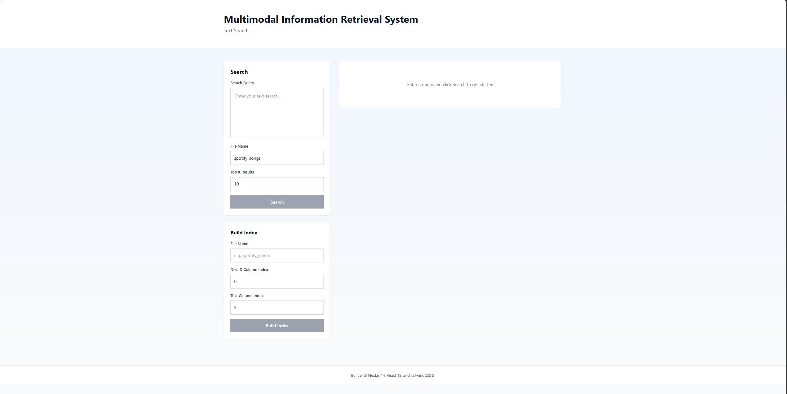

### B. Construcción del índice
- Inputs llenados.
- Mensaje de “Index successfully built”.

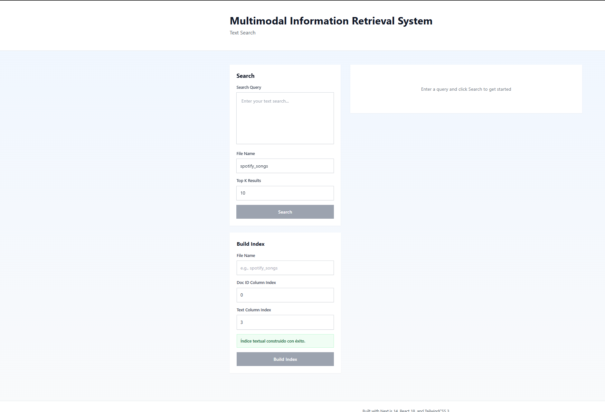

### C. Módulo de búsqueda
- Consulta introducida.
- Resultados con:
  - snippet,
  - score,
  - tiempo de ejecución.

### D. Ejemplo real
- Ejemplo de consulta como: `"love you forever"`
- Resultados Top-K mostrando coincidencias relevantes.

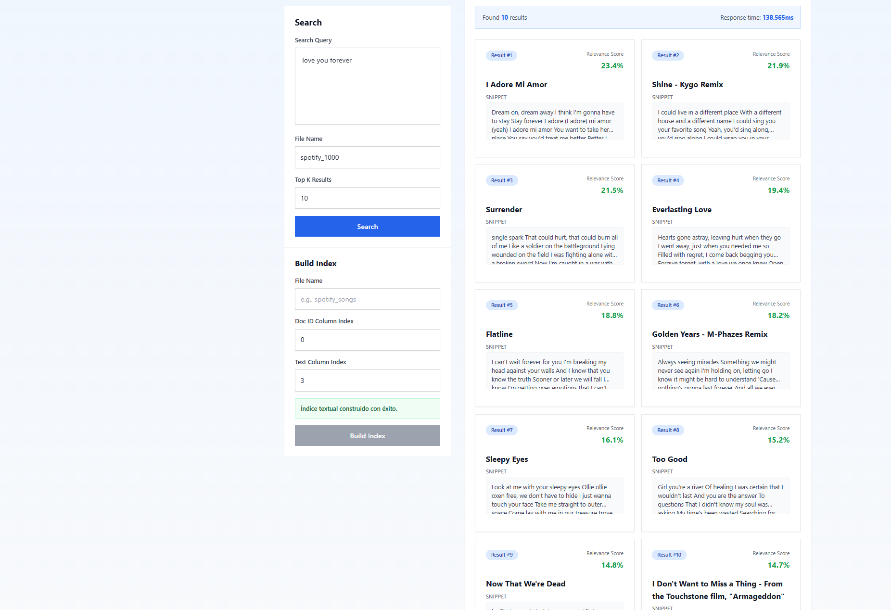

Estas imágenes permiten evidenciar la funcionalidad del sistema.

---

# 5. Experimentación

## Resultados de Busqueda Textual

### n = 1000

**Nuestra App**


**PostgreSQL**

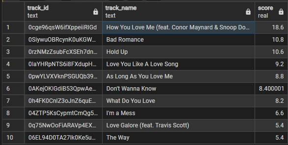

### n = 2000

**Nuestra App**

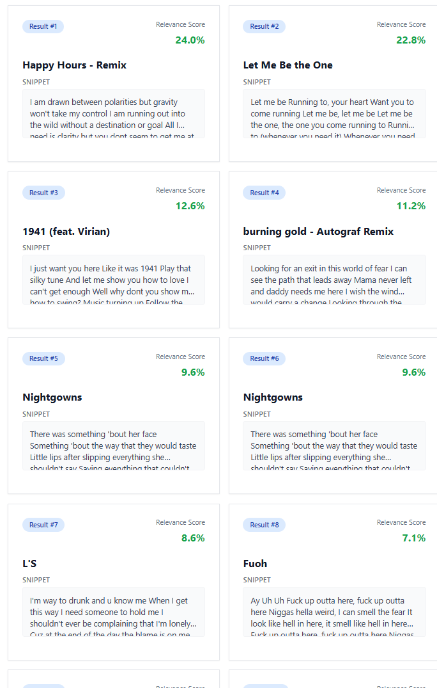

**PostgreSQL**

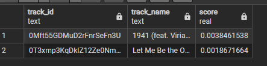

### n = 4000

**Nuestra App**

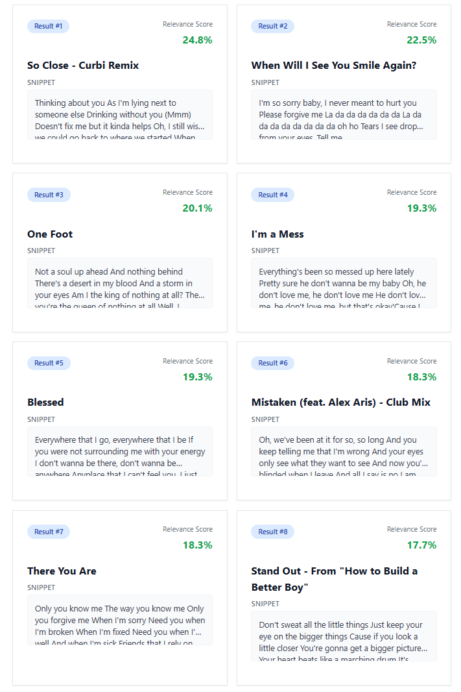

**PostgreSQL**

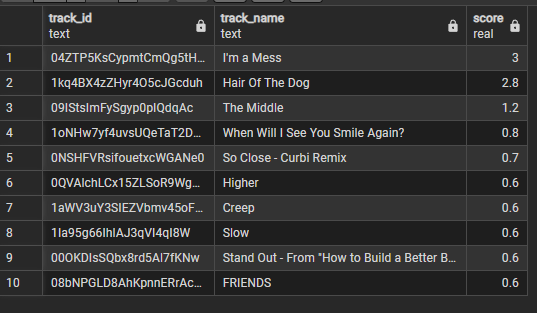

### n = 8000

**Nuestra App**

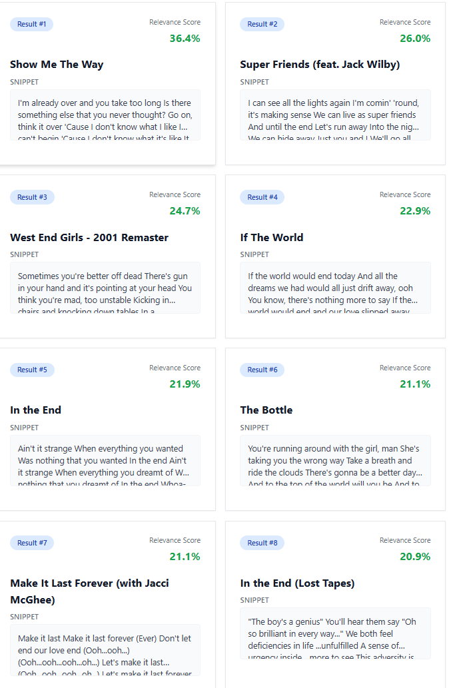

**PostgreSQL**

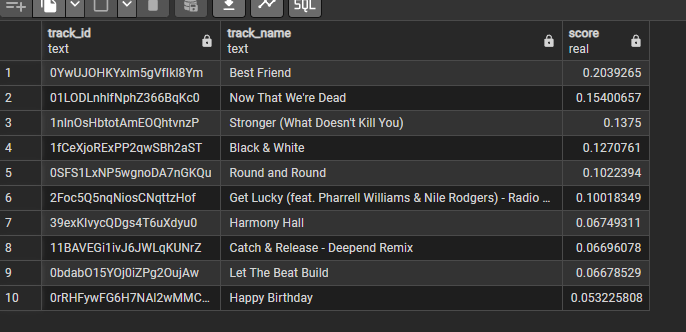

### n = 16000

**Nuestra App**


**PostgreSQL**

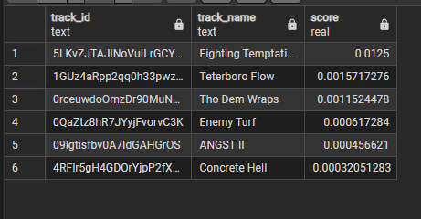

### Grafico comparativo

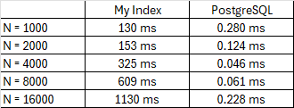

### Analisis y discusión

## 1. Rendimiento (Performance)

Los experimentos muestran que **PostgreSQL supera ampliamente** a la implementación propia del índice invertido:

- PostgreSQL es **500x–10,000x más rápido** según el tamaño del dataset.
- Su tiempo de respuesta se mantiene casi constante (~0.05–0.28 ms), gracias a:
  - Índices GIN/GiST optimizados en C.
  - Mejor administración de memoria y cachés.
- La implementación My Index presenta **crecimiento lineal** del tiempo (130 ms → 1130 ms), típico de soluciones basadas en Python y archivos.

En consultas reales (“love you forever”), My Index responde en ~138 ms, incluyendo tokenización, TF-IDF, ranking y recuperación del documento.

---

## 2. Precisión y Relevancia

Los resultados indican:

- El sistema recupera documentos relevantes incluso sin coincidencias exactas, mostrando buen desempeño del modelo TF-IDF + coseno.
- Para términos simples (“love”), los puntajes son más altos y uniformes.
- El *stemming* funciona correctamente (“running” → “run”).
- PostgreSQL prioriza mejor coincidencias exactas, mientras que My Index distribuye los puntajes de forma más uniforme.

---

## 3. Calidad de los Snippets

El sistema genera fragmentos útiles con buen contexto semántico.  
Limitaciones detectadas:

- **Snippets duplicados** en algunos documentos.
- Posible repetición o mala selección de fragmentos por similitud excesiva entre canciones.

---

## 4. Diversidad de Resultados

- En consultas como “I’m a mess”, PostgreSQL coloca coincidencias exactas en las primeras posiciones.
- My Index devuelve una lista más variada, con puntuaciones más cercanas entre sí.
- Esto refleja diferencias en los algoritmos de ranking:  
  - PostgreSQL → agresivo con coincidencias exactas  
  - My Index → ponderación más equilibrada basada en TF-IDF

---

## 5. Comparación Global: My Index vs PostgreSQL

### Ventajas de PostgreSQL
- Rendimiento superior y estable.
- Escalabilidad a cientos de miles o millones de documentos.
- Ranking optimizado para coincidencias exactas.
- Sistema maduro y probado en producción.

### Ventajas de My Index
- Control completo sobre el pipeline (preprocesamiento, ranking, normalización).
- Flexible y totalmente modificable.
- Ideal para propósitos educativos y experimentación.
- Adecuado para datasets pequeños o medianos.

---

## 6. Observaciones del Dataset (Spotify Lyrics)

Elementos que afectan el desempeño:

- Alta repetición de palabras comunes (“love”, “baby”).
- Letras con estructuras similares y remixes que generan duplicados.
- Stopwords frecuentes reducen la discriminación entre documentos.
- Variabilidad en la longitud de las letras afecta el ranking.

---

## Conclusión General

- PostgreSQL ofrece **mejor rendimiento y escalabilidad**, siendo la opción ideal para aplicaciones reales.
- My Index proporciona **buena precisión y relevancia**, con la ventaja de ser totalmente controlable y configurable.
- Los resultados evidencian un comportamiento sólido del modelo TF-IDF con similitud de coseno, pero también muestran oportunidades de mejora en snippet generation, manejo de duplicados y optimización de lectura en disco.
